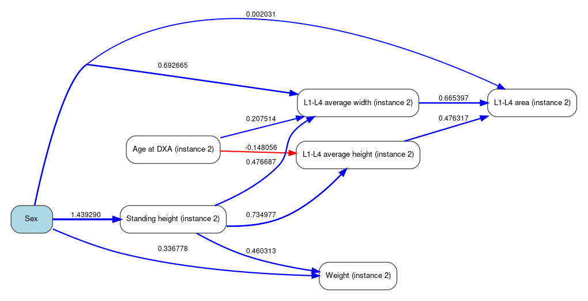

# 🦴 CHVAE: Counterfactual Spine DXA Image Synthesis

This repository contains the implementation of a **Causal Hierarchical Variational Autoencoder (CHVAE)** for **counterfactual AP spine DXA image synthesis**.

The model combines an explicit **structural causal model (SCM)** over structured metadata with a **two-level hierarchical variational autoencoder (HVAE)** observation model for image generation. It was developed for baseline-to-follow-up counterfactual synthesis of UK Biobank AP spine DXA images, where baseline images are used to generate plausible follow-up images under controlled interventions such as:

```python
do(age = follow_up_age)
```

---

## 📄 Paper

**From Baseline to Follow-Up: Counterfactual Spine DXA Image Synthesis in UK Biobank Using a Causal Hierarchical Variational Autoencoder**

**Authors:** Yilin Zhang, Nicholas C. Harvey, Nicholas R. Fuggle, Rahman Attar

This paper has been **accepted by the 48th Annual International Conference of the IEEE Engineering in Medicine and Biology Society (EMBC 2026)**.

**Preprint:** [arXiv:2605.22649](https://arxiv.org/abs/2605.22649)

**Code:** https://github.com/YilinZhang00/CHVAE

---

## 🔍 Overview

Dual-energy X-ray absorptiometry (DXA) is widely used for large-scale skeletal assessment and osteoporosis-related analysis. However, modelling how spine DXA images may evolve over time remains challenging because repeat imaging data are limited and longitudinal anatomical changes are often subtle.

This project addresses this problem by learning a causally structured generative model that can:

* reconstruct observed AP spine DXA images,
* model structured participant and morphometry metadata using an explicit causal graph,
* generate counterfactual images under controlled interventions,
* preserve subject-specific identity through abduction-action-prediction,
* evaluate counterfactual follow-up predictions against repeat-imaging measurements.

The model is trained on AP spine DXA images from the UK Biobank first imaging visit and evaluated in a baseline-to-follow-up setting using participants with repeat imaging.

---

## 🧠 Method Summary

The proposed CHVAE contains two main components:

1. a **structural causal model** for metadata,
2. a **hierarchical VAE observation model** for DXA image synthesis.

Together, these components allow the model to perform counterfactual image generation under interventions such as:

```python
do(age = target_age)
```

---

## 🧬 Structural Causal Model for Metadata

Structured covariates are represented using an explicit SCM. The metadata variables include:

* sex,
* age at DXA,
* standing height,
* weight,
* L1-L4 average width,
* L1-L4 average height,
* L1-L4 area.

The causal graph is estimated using a hybrid causal discovery pipeline with domain constraints. Age and sex are treated as root variables, and vertebral morphometry variables are modelled as downstream anatomical outcomes.

The discovered causal graph used as the SCM scaffold is provided in this repository as:

```text
pcstable_scm.png
```

This figure visualizes the PC-stable-based causal graph over the structured DXA metadata variables, including age, sex, anthropometric variables, and L1-L4 vertebral morphometry.

### Discovered Causal Graph



The SCM enables interventions such as:

```python
do(age = target_age)
```

while preserving subject-specific exogenous noise for non-intervened variables.

---

## 🏗️ Hierarchical VAE for DXA Image Generation

The image model uses a two-level hierarchical latent structure:

```text
z2 → z1 → x
```

where:

* `z2` captures higher-level global variation,
* `z1` captures lower-level residual anatomical detail,
* `x` is the AP spine DXA image.

The decoder is conditioned on a compact morphometry context vector derived from L1-L4 width, height, and area. This design links causal metadata changes to anatomically meaningful image variation.

Compared with a shallow latent image model, the hierarchical structure provides additional capacity to model multi-scale DXA image variation, including coarse body/spine structure and finer local anatomical detail.

---

## 🔁 Counterfactual Generation

Counterfactual DXA images are generated using the standard **abduction-action-prediction (AAP)** framework.

### Step 1: Abduction

Given an observed baseline image and metadata, the model infers:

* hierarchical image latents,
* subject-specific SCM exogenous noise,
* individual-specific latent representation.

### Step 2: Action

A causal intervention is applied to one or more variables. For example:

```python
do(age = age_inst3)
```

Only the intervened node is replaced. Other exogenous variables are preserved to maintain subject identity.

### Step 3: Prediction

The SCM is simulated forward under the intervention, a new morphometry context is computed, and the decoder generates the corresponding counterfactual DXA image.

This allows the model to generate intervention-aligned counterfactual images while preserving subject-specific anatomical identity.

---

## 🗂️ Repository Structure

```text
CHVAE/
│
├── causal_deepscm_hvae/
│   ├── arch/
│   │   └── medicalDXA.py
│   │
│   ├── distributions/
│   │   ├── deep.py
│   │   ├── mixture.py
│   │   ├── mvn.py
│   │   ├── mvt.py
│   │   ├── natural_mvn.py
│   │   ├── natural_nw.py
│   │   ├── products.py
│   │   ├── wishart.py
│   │   └── transforms/
│   │
│   ├── experiment/
│   │   └── medicalDXA/
│   │       ├── trainer.py
│   │       ├── tester.py
│   │       ├── base_experiment.py
│   │       └── dxa/
│   │           ├── base_sem_experiment.py
│   │           ├── causal_ukbDXA.py
│   │           └── roi_losses.py
│   │
│   ├── dataset.py
│   └── util.py
│
├── run_dxa_hvae.sh
├── requirements.txt
├── visualization_hvae.ipynb
├── pcstable_scm.png
└── README.md
```

---

## 📊 Dataset

This project was developed using AP spine DXA images from the **UK Biobank**.

The study used de-identified UK Biobank data under **Application Number 700191**. The training cohort was constructed from the first imaging visit, recorded as instance 2 in UK Biobank.

The main structured metadata variables used in the model are:

| Variable             | Type        | Description                            |
| -------------------- | ----------- | -------------------------------------- |
| Sex                  | Categorical | Participant sex                        |
| Age at DXA           | Continuous  | Age at the DXA imaging visit           |
| Standing height      | Continuous  | Anthropometric body size variable      |
| Weight               | Continuous  | Anthropometric body size variable      |
| L1-L4 average width  | Continuous  | Vertebral morphometry variable         |
| L1-L4 average height | Continuous  | Vertebral morphometry variable         |
| L1-L4 area           | Continuous  | Derived vertebral morphometry variable |

The image input consists of AP spine DXA images resized to:

```text
192 × 192
```

Due to UK Biobank data access restrictions, raw imaging data and participant metadata are **not included** in this repository.

---

## ⚙️ Installation

This repository was tested with **Python 3.13.5**.

Install the required dependencies from the provided `requirements.txt` file:

```bash
pip install -r requirements.txt
```

A fresh conda environment can be created as follows:

```bash
conda create -n chvae python=3.13.5 -y
conda activate chvae
pip install -r requirements.txt
```

The main dependencies are defined in `requirements.txt`, including PyTorch, Pyro, PyTorch Lightning, scientific computing libraries, image processing packages, and TensorBoard utilities.

---

## 🚀 Training

The training script is provided as:

```bash
run_dxa_hvae.sh
```

To start training, run:

```bash
./run_dxa_hvae.sh
```

If the script is not executable, first run:

```bash
chmod +x run_dxa_hvae.sh
```

and then start training again:

```bash
./run_dxa_hvae.sh
```

By default, training outputs, checkpoints, and TensorBoard logs are saved under the directory specified by `--default_root_dir` in `run_dxa_hvae.sh`.

For the provided script, this is typically:

```text
./causal_deepscm_hvae/runs
```

---

## 🖥️ GPU Notes

The original experiments were designed for high-memory GPUs such as A100. If running on a smaller GPU such as an NVIDIA L4, the following settings may be more stable:

```bash
--train_batch_size 16
--test_batch_size 8
--num_svi_particles 2
--w_ssim 0.0
--roi_w_ssim 0.0
```

For A100 or other high-memory GPUs, larger batch sizes and more SVI particles can be used.

---

## 📈 TensorBoard

Training logs are saved under:

```text
causal_deepscm_hvae/runs/
```

To launch TensorBoard:

```bash
tensorboard --logdir ./causal_deepscm_hvae/runs --host 0.0.0.0 --port 6006
```

Then open in a browser:

```text
http://localhost:6006
```

When working on a remote server, SSH port forwarding may be required.

---

## 🧪 Evaluation

The model supports several evaluation modes.

### 1. Factual Reconstruction

The model reconstructs observed AP spine DXA images from inferred hierarchical latents and metadata context.

Reconstruction quality can be evaluated using:

* MAE,
* RMSE,
* PSNR,
* SSIM.

### 2. Counterfactual Age Sweep

For a fixed subject, counterfactual images can be generated under an age intervention sequence such as:

```python
do(age = 50)
do(age = 55)
do(age = 60)
do(age = 65)
do(age = 70)
do(age = 75)
do(age = 80)
```

Difference maps can be computed between counterfactual and factual reconstructions to highlight intervention-induced anatomical changes.

### 3. Baseline-to-Follow-Up Evaluation

For participants with repeat imaging, baseline instance 2 observations are used for abduction. The model then generates counterfactual follow-up predictions using:

```python
do(age = age_inst3)
```

The resulting counterfactual morphometry is compared with observed instance 3 measurements.

---

## 📌 Main Results Reported in the Paper

### Factual Reconstruction

The CHVAE achieved the following reconstruction quality on the test set:

| Metric | Result          |
| ------ | --------------- |
| MAE    | 0.0509 ± 0.0062 |
| RMSE   | 0.0891 ± 0.0139 |
| PSNR   | 21.10 ± 1.31 dB |
| SSIM   | 0.574 ± 0.031   |

These results indicate that the model captures the overall DXA intensity distribution and coarse anatomical structure, while some fine-grained vertebral edge detail remains challenging.

### Follow-Up Morphometry Evaluation

Under `do(age = age_inst3)`, the model achieved strong absolute-level agreement between counterfactual follow-up predictions and observed repeat-imaging morphometry:

| Follow-up target     | Absolute R² |
| -------------------- | ----------- |
| L1-L4 average width  | 0.918       |
| L1-L4 average height | 0.854       |
| L1-L4 area           | 0.931       |

Directional change agreement was:

```text
Sign agreement = 0.615
```

This suggests that the model preserves between-subject ordering and produces well-calibrated follow-up morphometry at the cohort level, while subtle within-subject change direction remains more challenging.

---

## 🖼️ Example Outputs

The repository includes example visualizations for the causal graph and CHVAE-based counterfactual synthesis.

```text
pcstable_scm.png
```

contains the discovered causal graph used as the structural causal model scaffold for metadata.

```text
visualization_hvae.ipynb
```

provides example code for factual reconstruction, counterfactual age sweeps, and difference map visualization.

---

## 🧩 Key Features

* Causal generative modelling for AP spine DXA images.
* Explicit SCM over structured metadata.
* PC-stable-based causal graph saved as `pcstable_scm.png`.
* Hierarchical latent image model.
* Metadata-conditioned image decoder.
* Abduction-action-prediction counterfactual inference.
* Support for age intervention and age sweep visualization.
* Follow-up evaluation using UK Biobank repeat imaging.
* Reconstruction and morphometry-based evaluation metrics.
* TensorBoard logging for training monitoring.

---

## ⚠️ Data Availability

The raw UK Biobank DXA images and metadata are not included in this repository because they are subject to UK Biobank data access restrictions.

Researchers interested in using the data should apply directly through UK Biobank.

---

## 📚 Citation

The official EMBC proceedings citation will be updated once the final publication details are available.

For now, please cite the arXiv preprint:

```bibtex
@misc{zhang2026chvae,
  title={From Baseline to Follow-Up: Counterfactual Spine DXA Image Synthesis in UK Biobank Using a Causal Hierarchical Variational Autoencoder},
  author={Zhang, Yilin and Harvey, Nicholas C. and Fuggle, Nicholas R. and Attar, Rahman},
  year={2026},
  eprint={2605.22649},
  archivePrefix={arXiv},
  url={https://arxiv.org/abs/2605.22649}
}
```

---

## 👤 Contact

For questions about the code or paper, please contact:

**Yilin Zhang**
School of Electronics and Computer Science
University of Southampton
Email: [Yilin.Zhang@soton.ac.uk](mailto:Yilin.Zhang@soton.ac.uk)

---

## 📝 Acknowledgement

This research was conducted using de-identified UK Biobank data under Application Number 700191.

The experimental procedures involving human participants were approved as part of the UK Biobank study by the North West Multi-centre Research Ethics Committee. All participants provided informed consent.
